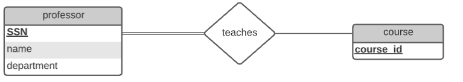
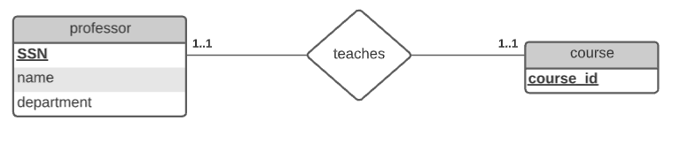
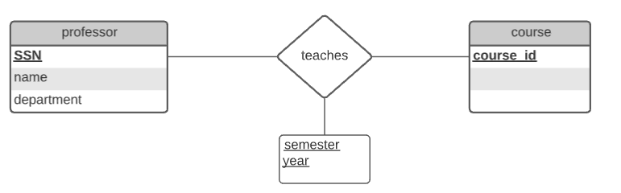

# Laboratoire 3
## Pratique des diagrammes ER

#### Exercice 1

En choisissant `ssn` et `course_id` comme clé primaire on s'assure que seul le semestre le plus récent sera enregisté.

#### Exercice 2

#### Exercice 3

#### Exercice 4

#### Exercice 5 

En choisissant `ssn` , `course_id` et `semester` comme clé primaire on s'assure que tous les semestres  seront enregistrés.

#### Exercice 6

